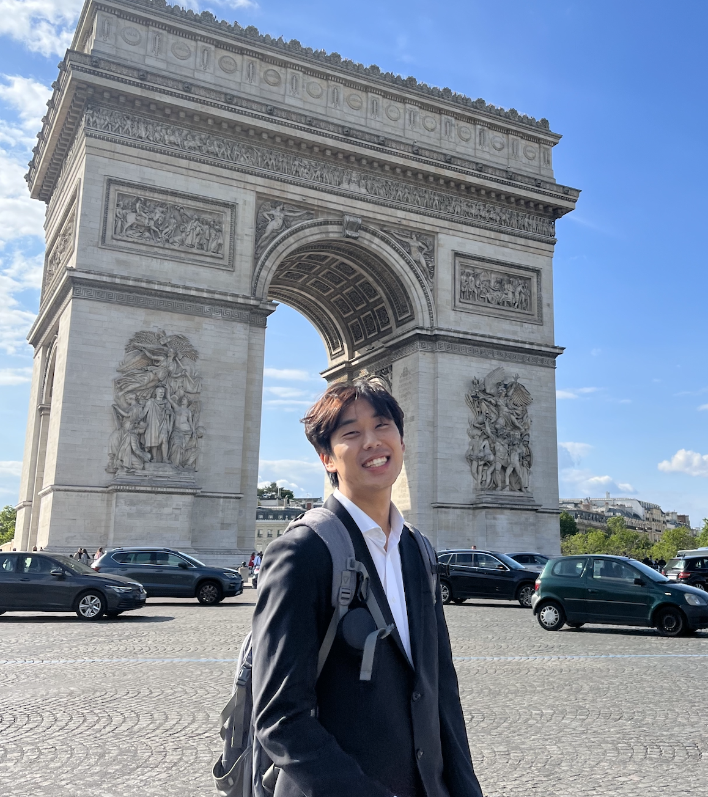

---
# Minimal Jekyll front matter so GitHub Pages renders Markdown as a site
layout: default
title: In Kyu Lee
---

# In Kyu Lee
{:style="width:160px; border-radius:50%; margin-top:1rem;"}

PhD student, Medical Imaging & AI, UC San Diego  
📧 [inqlee0704@gmail.com](mailto:inqlee0704@gmail.com)  
[CV (PDF)](assets/InKyuLee_CV.pdf) · [Google Scholar](https://scholar.google.com/citations?user=WYCKXg0AAAAJ&hl=en) ·  [LinkedIn]([#](https://www.linkedin.com/in/in-kyu-lee-6a0850219/))

---

## About
I study physics-based medical imaging and AI. My recent work spans synchrotron microCT analysis of bone marrow in chronic lymphocytic leukemia, coronary angiography segmentation and detection, and quantitative CT pipelines across registration, deep learning segmentation, and statistical modeling.

---

## Education
- **University of California, San Diego**  
  Ph.D., Mechanical Engineering — Sept 2024 – Present  
  Advisor: Claire Acevedo

- **University of Kansas**  
  M.S., Bioengineering (Honors) — Jul 2022
  Advisor: Jiwoong Choi

- **University of Minnesota – Twin Cities**  
  B.S., Aerospace Engineering & Mechanics; Minor in Computer Science — May 2020 
  Advisor: Hyun Soo Park

---

## Experience
- **Graduate Research Assistant, UCSD — F² Lab** *(Aug 2024 – Present)*  
  Segmentation and quantification pipeline for microCT; marrow microenvironments in CLL using synchrotron microCT.

- **Research Scientist, Medipixel** *(Aug 2022 – Aug 2024)*  
  Local refinement module for coronary lesion & bifurcation; led MICCAI ARCADE tasks; video-based complication detection; automated CFD (PyFluent).

- **Graduate Research Assistant, KU Medical Center** *(Aug 2020 – Jul 2022)*  
  Quantitative CT pipeline: DL segmentation, registration, ML analytics.

- **Research Assistant, Seoul National University Hospital** *(Summers 2019 & 2020)*  
  Analyzed environmental exposure in lung-disease cohorts (PCA, k-means); associated QCT variables with particulate-matter exposure.

---

## Selected Publications
- **Disruption of marrow microenvironments in chronic lymphocytic leukemia by high-resolution synchrotron micro-CT**  
  *Lee IK, Obata Y, Pmicter A, Williams J, Kikani B, Jensen C, Sborov D, Stephens D, Acevedo C* — *bioRxiv*, 2025

- **Diffusion-Based User-Guided Data Augmentation for Coronary Stenosis Detection**  
  *Seo S, Lee IK, Kim H-W, Min J, Jung C-H* — *MICCAI*, 2025

- **Gray’s Anatomy for Segmenting Anything Model: Optimizing Grayscale Medical Images for Fast and Lightweight Segmentation**  
  *Lee IK, Ku J, Choi Y* — *CVPR Workshop*, 2024

- **SASS: Semi-Supervised Approach for Stenosis Segmentation (ARCADE Challenge)**  
  *Lee IK, Shin J, Lee Y-H, Ku JH, Kim H-W* — *MICCAI ARCADE*, 2023 [(arXiv:2311.10281)](https://arxiv.org/abs/2311.10281)

- **MPSeg: Multi-Phase Strategy for Coronary Artery Segmentation (ARCADE Challenge)**  
  *Ku JH, Lee Y-H, Shin J, Lee IK, Kim H-W* — *MICCAI ARCADE*, 2023 [(arXiv:2311.10306)](https://arxiv.org/abs/2311.10306)

- **HUMBI: A Large Multiview Dataset of Human Body Expressions**  
  *Yu Z, Yoon JS, Lee IK, Venkatesh P, Park J, Yu J, Park HS* — *CVPR*, 2020

---

## Talks
- *Disruption of marrow microenvironments in CLL by high-resolution synchrotron micro-CT* — SES, Atlanta, Oct 12–15, 2025 (oral)
- *Quantitative CT and CFD Explain Bronchodilator-induced Regional Ventilation Improvement in Asthma* — ICAN, San Francisco, May 12–13, 2022 (oral)
- *Toward extended quantitative CT imaging application with deep transfer learning* — ATS, May 14–19, 2021 (poster)

---

## Honors & Awards
- ASH Abstract Achievement Award (2025)
- MICCAI 2023 ARCADE — 1st (Stenosis) & 2nd (Artery)
- Outstanding Student Researcher Award (KU, 2023)
- Burn Diagnosis AI Challenge — 1st (2022)

---

## Patents & Skills
**Patents:** matching medical images by respiration phase; labeling medical images; FFR data generation.  
**Programming:** Python, MATLAB, Fortran  
**Languages:** Korean, English, Chinese 

---

## Contact
For collaborations or speaking, please email me with a short project description and preferred dates.  
📧 [inqlee0704@gmail.com](mailto:inqlee0704@gmail.com)

---

© 2025 In Kyu Lee
