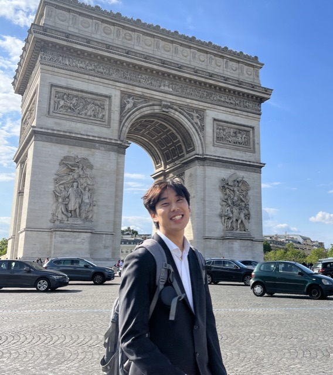
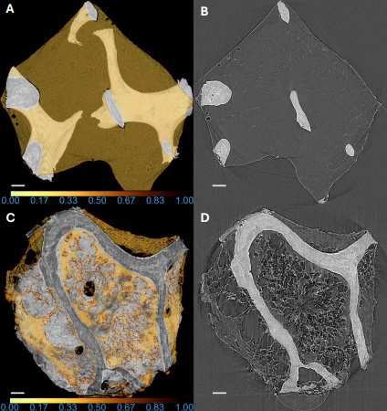
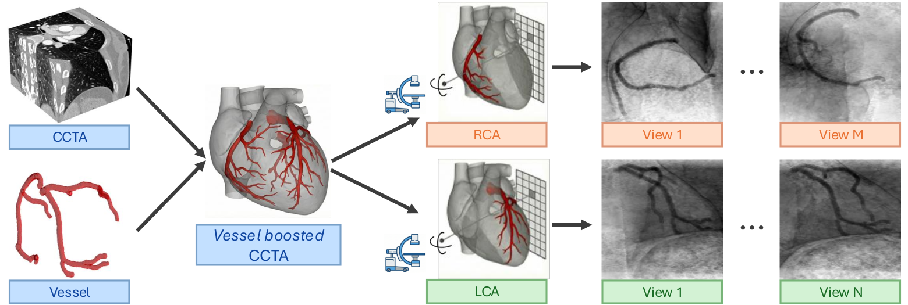
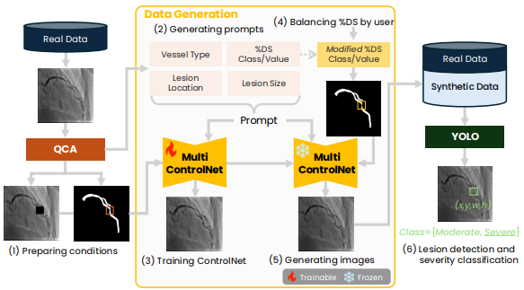
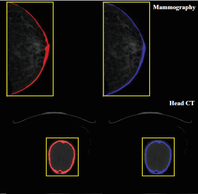
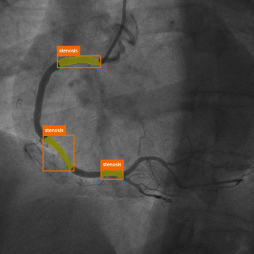
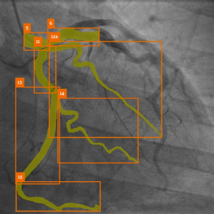
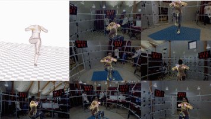

# In Kyu Lee

Ph.D. Student @University of California, San Diego

inqlee0704 [at] gmail.com 
<a href="assets/InKyuLee_CV.pdf">CV</a>·<a href="https://scholar.google.com/citations?user=WYCKXg0AAAAJ&hl=en">Google Scholar</a>·<a href="https://www.linkedin.com/in/in-kyu-lee-6a0850219/">LinkedIn</a>

My research sits at the intersection of physics, medical imaging, and AI — synchrotron micro-CT of bone marrow, coronary angiography, and quantitative CT pipelines that combine image registration, deep learning, and statistical modeling, lately with a focus on self-supervised learning. I work with [Dr. Claire Acevedo](https://jacobsschool.ucsd.edu/people/profile/Claire_Acevedo) at UC San Diego, after an M.S. in Bioengineering (Honors) at the University of Kansas with [Dr. Jiwoong Choi](https://www.kumc.edu/jchoi4.html) and [Dr. William Brooks](https://berc.ku.edu/people/william-brooks), and a B.S. in Aerospace Engineering & Mechanics with a Computer Science minor at the University of Minnesota with [Dr. Hyun Soo Park](https://www-users.cse.umn.edu/~hspark/).

## Publications

[Disruption of Marrow Microenvironments in Chronic Lymphocytic Leukemia by High-Resolution Synchrotron Micro-Computed Tomography](https://www.biorxiv.org/content/10.1101/2025.10.20.683519v1.full.pdf)

**Lee IK,** Obata Y, Pomicter A, Williams J, Kikani B, Jensen C, Sborov D, Stephens D, Acevedo C — *Communications Medicine*, 2026 *(accepted)*

[Anatomy-Grounded Synthetic Coronary Angiography for Geometry-Informed Multi-View Matching](https://geometry-informed-multi-view-matching.github.io/)

**Lee IK\*,** Seo S\*, Min J — *MICCAI*, 2026 *(\* equal contribution)*

[Diffusion-Based User-Guided Data Augmentation for Coronary Stenosis Detection](https://papers.miccai.org/miccai-2025/paper/3613_paper.pdf)

Seo S, **Lee IK,** Kim H-W, Min J, Jung C-H — *MICCAI*, 2025

[Gray's Anatomy for Segmenting Anything Model: Optimizing Grayscale Medical Images for Fast and Lightweight Segmentation](https://link.springer.com/chapter/10.1007/978-3-031-81854-7_16)

**Lee IK,** Ku J, Choi Y — *CVPR Workshop: MedSAM*, 2024

[SASS: Semi-Supervised Approach for Stenosis Segmentation](https://arxiv.org/abs/2311.10281)

**Lee IK,** Shin J, Lee Y-H, Ku JH, Kim H-W — *MICCAI Workshop: ARCADE*, 2023 · *1st place, stenosis track*

[MPSeg: Multi-Phase Strategy for Coronary Artery Segmentation](https://arxiv.org/abs/2311.10306)

Ku JH, Lee Y-H, Shin J, **Lee IK,** Kim H-W — *MICCAI Workshop: ARCADE*, 2023 · *2nd place, artery track*

[HUMBI: A Large Multiview Dataset of Human Body Expressions](https://openaccess.thecvf.com/content_CVPR_2020/papers/Yu_HUMBI_A_Large_Multiview_Dataset_of_Human_Body_Expressions_CVPR_2020_paper.pdf)

Yu Z\*, Yoon JS\*, **Lee IK,** Venkatesh P, Park J, Yu J, Park HS — *CVPR*, 2020 *(\* equal contribution)*

### Thesis

<video src="assets/thesis_1dcfd.mp4" poster="assets/thesis_1dcfd.jpg" width="320" height="180" autoplay loop muted playsinline aria-label="1D CFD of airway flow driven by inspiration and expiration CT"></video>

Extended Quantitative Computed Tomography Analysis of Lung Structure and Function

**Lee IK** — M.S. thesis, *University of Kansas*, 2022

## Conference Presentations

- Oct 2025Disruption of marrow microenvironments in CLL by high-resolution synchrotron micro-CT

  Society of Engineering Science (SES), Atlanta — **oral**

- May 2022Quantitative CT and CFD explain bronchodilator-induced regional ventilation improvement in asthma

  International Collaborative Asthma Network (ICAN), San Francisco — **oral**

- May 2021Toward extended quantitative CT imaging application with deep transfer learning

  American Thoracic Society (ATS) — poster
{: .list}

## Experience

- 2024 – Present**Graduate Research Assistant** · UC San Diego, F² Lab

  Segmentation and quantification pipeline for micro-CT; marrow microenvironments in CLL using synchrotron micro-CT.

- 2022 – 2024**Research Scientist** · Medipixel

  Frame recommendation from image quality assessment, shipped in [MPXA](https://medipixel.io/products/medipixelxa); local refinement for coronary lesions and bifurcations; video-based complication detection; led the MICCAI ARCADE Challenge; automated CFD with PyFluent.

- 2020 – 2022**Graduate Research Assistant** · KU Medical Center

  Quantitative CT pipeline: deep learning segmentation, image registration, and 1D CFD modeling.

- Summers 2019, 2020**Research Assistant** · Seoul National University Hospital

  Analyzed environmental exposure in lung-disease cohorts; associated QCT variables with particulate-matter exposure.

- 2019 – 2020**Undergraduate Research Assistant** · University of Minnesota

  Processed the Human Multiview Behavior Imaging (HUMBI) dataset; reconstructed 3D human body meshes from multiview 2D images.

- 2015 – 2017**Sergeant** · Republic of Korea Army
{: .list}

## Teaching

- Fall 2026**MAE 290A: Numerical Linear Algebra** · Graduate TA, UC San Diego

- Spring 2026**BENG/MAE 209: Continuum Mechanics Applied to Medicine & Biology** · Graduate TA, UC San Diego

- Spring 2019**AEM 3031: Deformable Body Mechanics** · Undergraduate TA, University of Minnesota

- 2018 – 2020**Peer Tutor** · SMART Learning Commons, University of Minnesota
{: .list}

## Honors & Awards

- 2025Abstract Achievement Award — American Society of Hematology (ASH)

- 2023MICCAI ARCADE Challenge — 1st place (stenosis), 2nd place (artery)

- 2023Social Issues Data & AI Analysis Competition — 2nd place, National Research Council of Korea

- 2023Outstanding Student Researcher Award — University of Kansas

- 2022Burn Diagnosis AI Challenge — 1st place, Ministry of Science and ICT of Korea

- 2022Lung Cancer WSI Segmentation Competition — 2nd place, Ajou University Medical Center

- 2022International Collaborative Asthma Network (ICAN) Travel Award

- 2022Plaque of Appreciation — President of the Korean American Society of Greater Kansas City

- 2019Undergraduate Research Opportunity Program (UROP) Award — University of Minnesota

- 2019Chester Gaskell Aeronautical Engineering Scholarship — University of Minnesota
{: .list}

## Patents

- Method and apparatus for matching medical images considering phase of respiration signal
- Method and electronic device for labeling medical image
- Prediction model training method, FFR data generating method and electronic device performing the same

## Certifications

- 2021Fundamentals of Accelerated Computing with CUDA Python — NVIDIA

- 2020AI for Healthcare Nanodegree — Udacity

- 2019Certified Level III Master Tutor — College Reading & Learning Association (CRLA)
{: .list}

## Skills

**Programming** — Python, MATLAB, Fortran
{: .skills}

**Languages** — Korean (native), English (fluent), Chinese (fluent)
{: .skills}

**Competitions** — Kaggle Competitions Expert
{: .skills}
